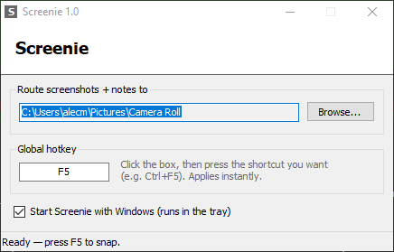

# Screenie

Windows screenshot + note tool for Claude Code workflows. Global hotkey → region snip → note → paired `snap_*.png` / `snap_*.txt` in a target folder.



## Usage

- `F5` — drag to capture. Saves immediately, also copied to clipboard.
- Note prompt: `Enter` save, `Ctrl+Enter` newline, `Esc` skip.
- Output: `snap_YYYYMMDD_HHMMSS.png` + `.txt` in the route folder.

## Claude Code

Route to `.screenie/` in your project (gitignored), add to CLAUDE.md:

```
## Screenie
.screenie/ is an inbox of annotated screenshots: each snap_*.png has a matching
snap_*.txt saying what to do with it. On frontend/UI requests, review pending
pairs first. Delete each pair once handled.
```

## Config

- Route folder: in-app, or tray icon > Route to.
- Hotkey: click the box in-app, press a combo. F1–F12 / A–Z / 0–9 / PrintScreen, with Ctrl/Alt/Shift. Global F5 shadows browser refresh.
- Autostart via HKCU Run key (checkbox in-app).
- Close/minimize → tray. Exit from tray menu.
- `%APPDATA%\Screenie\config.ini`

## Build

`build.bat` — compiles `Screenie.cs` with the csc bundled in Windows, no SDK. Or grab `Screenie.exe` from Releases.
